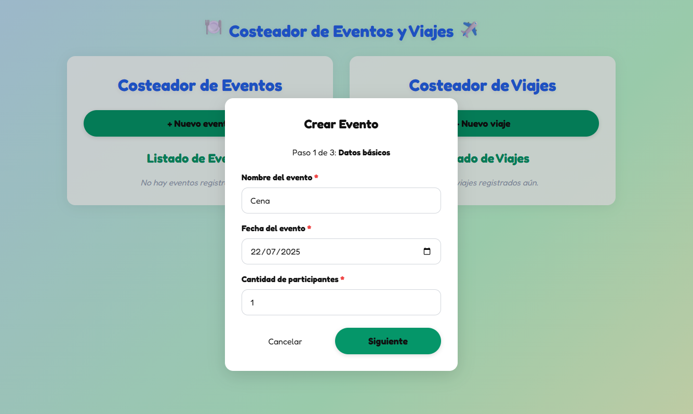
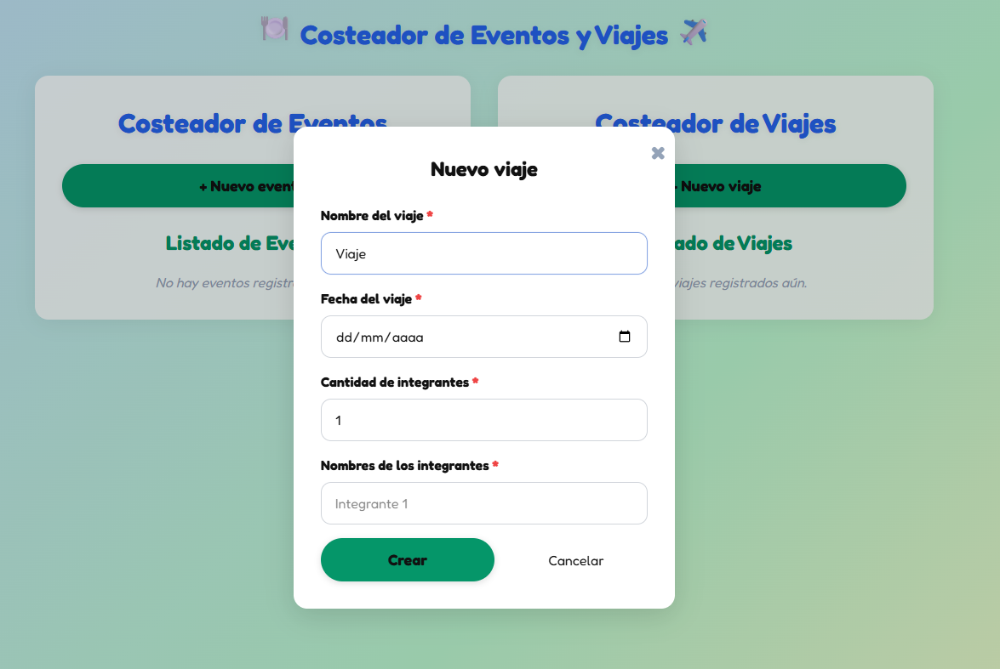

# ✈️🍽️ Costeador de Eventos y Viajes

¡Bienvenido a Costeador de Eventos y Viajes! Una aplicación web interactiva para organizar, dividir y visualizar gastos de eventos (cenas, reuniones, cumpleaños, etc.) y viajes grupales de manera sencilla y visual.

---

## 🚀 Demo en Vivo
¡Prueba la aplicación tú mismo!

[Demo](https://github.com/manterolaenrique/AppCosto) <!-- Cambia este enlace por el de tu deploy si tienes uno -->

---

## ✨ Vistazo Rápido
Aquí tienes algunas capturas de pantalla de la aplicación en acción:

### 🏠 Dashboard Principal


### 🍽️ Costeador de Eventos



### ✈️ Costeador de Viajes



---

## 💡 Características Principales
- **Costeador de Eventos:**
  - Flujo multi-step para crear eventos y dividir gastos.
  - Agrega participantes, define quién pagó y cuánto, y calcula automáticamente los saldos.
  - Edición rápida de nombre y fecha desde el dashboard.
  - Visualización clara de quién debe pagar o recibir dinero.
- **Costeador de Viajes:**
  - Registro de viajes y participantes.
  - Agrega gastos individuales y visualiza el balance de cada integrante.
  - Detalle de saldos y totales por viaje.
- **UX Moderna:**
  - Interfaz clara, responsiva y amigable.
  - Modales y formularios validados.
  - Mensajes visuales cuando no hay datos.

---

## 🛠️ Tecnologías Utilizadas
- React (Next.js App Router)
- TypeScript
- CSS personalizado
- Context API y hooks

---

## 🏗️ Instalación y Uso
Sigue estos sencillos pasos para tener la aplicación funcionando localmente:

1. Clona el repositorio:

   ```bash
   git clone https://github.com/manterolaenrique/AppCosto.git
   ```

2. Navega al directorio del proyecto:

   ```bash
   cd AppCosto
   ```

3. Instala las dependencias:

   ```bash
   npm install
   # o si usas yarn
   # yarn install
   ```

4. Ejecuta la aplicación en modo desarrollo:

   ```bash
   npm run dev
   # o si usas yarn
   # yarn dev
   ```

La aplicación debería abrirse en tu navegador en [http://localhost:3000](http://localhost:3000).

---

¡Disfruta organizando tus eventos y viajes sin enredos de cuentas! ✨
